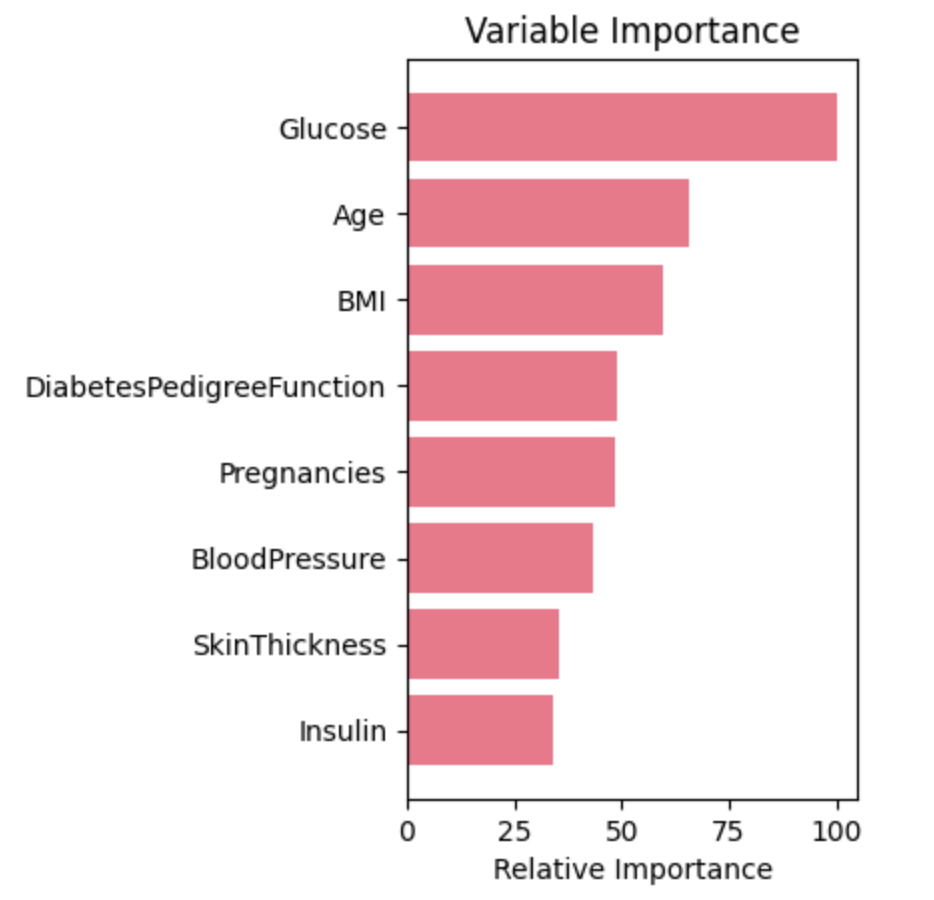

# CRISP-DM Case Study: Predicting Diabetes Onset Using the Pima Indians Diabetes Database

## Executive Summary
This project applies the CRISP-DM (Cross-Industry Standard Process for Data Mining) methodology to predict the onset of diabetes using the Pima Indians Diabetes Database. By following the six phases of CRISP-DM—Business Understanding, Data Understanding, Data Preparation, Modeling, Evaluation, and Deployment—we developed a robust predictive model that accurately forecasts diabetes onset based on diagnostic measures. The model aims to assist in early diagnosis and timely intervention, thereby improving patient outcomes.

*Figure 1: CRISP-DM diagram*

## Table of Contents
1. [Introduction](#1-introduction)
    - [1.1 Project Overview](#11-project-overview)
    - [1.2 Methodology](#12-methodology)
2. [Business Understanding](#2-business-understanding)
    - [2.1 Problem Definition](#21-problem-definition)
    - [2.2 Project Objectives](#22-project-objectives)
3. [Data Understanding](#3-data-understanding)
    - [3.1 Data Collection](#31-data-collection)
    - [3.2 Data Exploration](#32-data-exploration)
    - [3.3 Data Quality](#33-data-quality)
4. [Data Preparation](#4-data-preparation)
    - [4.1 Data Cleaning](#41-data-cleaning)
    - [4.2 Feature Engineering](#42-feature-engineering)
    - [4.3 Data Transformation](#43-data-transformation)
    - [4.4 Data Splitting](#44-data-splitting)
5. [Modeling](#5-modeling)
    - [5.1 Model Selection](#51-model-selection)
    - [5.2 Baseline Models](#52-baseline-models)
    - [5.3 Model Tuning](#53-model-tuning)
    - [5.4 Ensemble Methods](#54-ensemble-methods)
6. [Evaluation](#6-evaluation)
    - [6.1 Model Performance](#61-model-performance)
    - [6.2 Error Analysis](#62-error-analysis)
    - [6.3 Feature Importance](#63-feature-importance)
7. [Deployment](#7-deployment)
    - [7.1 Model Saving and Usage](#71-model-saving-and-usage)
    - [7.2 Deployment Strategy](#72-deployment-strategy)
8. [Results](#8-results)
9. [Documentation and Communication](#9-documentation-and-communication)
    - [9.1 Future Work](#91-future-work)
    - [9.2 Conclusion](#92-conclusion)
10. [Appendices](#10-appendices)
    - [10.1 Code](#101-code)
    - [10.2 Data Description](#102-data-description)
11. [References](#11-references)

## 1. Introduction

### 1.1 Project Overview
This project aims to predict the onset of diabetes based on diagnostic measures. The data used in this project is the Pima Indians Diabetes Database, which contains several medical predictor variables and one target variable indicating whether or not a patient has diabetes. The primary objective is to build a predictive model with high accuracy to aid early diagnosis and intervention strategies for diabetes.

### 1.2 Methodology
This project follows the CRISP-DM (Cross-Industry Standard Process for Data Mining) framework, a robust and widely-used methodology for data mining projects. The CRISP-DM process includes six phases: Business Understanding, Data Understanding, Data Preparation, Modeling, Evaluation, and Deployment.

## 2. Business Understanding

### 2.1 Problem Definition
The primary problem addressed in this project is predicting whether a patient will develop diabetes based on certain diagnostic measures. Early and accurate prediction can significantly improve patient outcomes by enabling timely medical intervention.

### 2.2 Project Objectives
The main objective is to build a predictive model that accurately forecasts diabetes onset. The model should be robust, interpretable, and deployable in a real-world medical setting.

## 3. Data Understanding

### 3.1 Data Collection
The dataset used in this project is the Pima Indians Diabetes Database. It includes 768 observations and 9 attributes, comprising 8 diagnostic measurements (features) and 1 binary outcome (target) indicating the presence or absence of diabetes.

### 3.2 Data Exploration
Initial exploration involved understanding the structure and characteristics of the data. The dataset comprises the following features:
- Number of times pregnant
- Plasma glucose concentration after 2 hours in an oral glucose tolerance test
- Diastolic blood pressure (mm Hg)
- Triceps skin fold thickness (mm)
- 2-Hour serum insulin (mu U/ml)
- Body mass index (weight in kg/(height in m)^2)
- Diabetes pedigree function
- Age (years)
- Outcome (0 or 1)

Basic statistics and visualizations, such as histograms, box plots, and pair plots, were used to understand data distributions and relationships between features.

### 3.3 Data Quality
Data quality issues such as missing values and outliers were identified. For instance, certain features had zero values where it was not clinically plausible (e.g., BMI or blood pressure). These issues were addressed during the data preparation phase.

## 4. Data Preparation

### 4.1 Data Cleaning
Data cleaning involved handling missing values and outliers. Missing values were treated using appropriate imputation techniques, and outliers were identified and either corrected or removed based on their impact on model performance.

### 4.2 Feature Engineering
Feature engineering included scaling features using Standard Scaler and MinMax Scaler. This step was crucial for algorithms sensitive to feature scaling. Additionally, new features were created, and important features were selected based on their relevance to the target variable.

### 4.3 Data Transformation
Data transformation techniques, such as log transformation and square root transformation, were applied to stabilize variance and make the data more normally distributed, thereby improving model performance.

### 4.4 Data Splitting
The dataset was split into training, validation, and test sets to ensure the models were evaluated on unseen data. This helps in assessing the generalization capability of the models.

## 5. Modeling

### 5.1 Model Selection
A variety of algorithms were selected for initial modeling, including Logistic Regression, K-Nearest Neighbors (KNN), Support Vector Classifier (SVC), Decision Trees, Naive Bayes, and ensemble methods like Random Forest and Gradient Boosting.

### 5.2 Baseline Models
Baseline models were built to establish a performance benchmark. These models provided insights into the data and helped identify areas for improvement.

### 5.3 Model Tuning
Hyperparameter tuning was performed using Grid Search and Random Search to optimize model performance. This step involved experimenting with different hyperparameter values to find the best combination.

### 5.4 Ensemble Methods
Ensemble methods, such as Voting Classifier and Stacking, were employed to combine the strengths of multiple models. These methods generally improve prediction accuracy by leveraging the diversity of individual models.

## 6. Evaluation

### 6.1 Model Performance
Model performance was evaluated using metrics like accuracy, precision, recall, and F1-score. Confusion matrices and ROC curves were used to provide a visual representation of model performance.

### 6.2 Error Analysis
Error analysis involved examining the errors made by the models. This helped identify patterns in misclassifications and provided insights into potential improvements.

### 6.3 Feature Importance
Feature importance analysis was conducted to understand which features contributed most to the model predictions. This analysis also enhanced model interpretability and trustworthiness.

*Figure 2: Feature importance analysis was conducted to understand which features contributed most to the model predictions. This analysis also enhanced model interpretability and trustworthiness.*

## 7. Deployment

### 7.1 Model Saving and Usage
The final models were saved using serialization techniques such as Pickle or Joblib, making them available for future use. This step ensures that the models can be easily deployed in a real-world medical setting.

### 7.2 Deployment Strategy
Potential deployment strategies include integrating the predictive model into a healthcare application where it can provide real-time predictions based on patient input data. This requires ensuring the model is accessible, secure, and scalable.

## 8. Results

### Summary of Results

*** Action Item: Create Table to Summarize Results ***

## 9. Documentation and Communication

### 9.1 Future Work
Future work involves exploring more advanced algorithms like XGBoost, LightGBM, or Neural Networks. Further feature engineering and data collection can also enhance model performance. Additionally, real-world testing and feedback will be crucial for continuous improvement.

### 9.2 Conclusion
The project successfully demonstrated how data science techniques can be applied to predict the onset of diabetes. The use of the CRISP-DM methodology ensured a structured and comprehensive approach, leading to a robust predictive model. Continuous iteration and improvement based on new data and feedback will further enhance the model's utility in clinical settings.

## 10. Appendices

### 10.1 Code
The complete code for this project can be found in the accompanying Jupyter notebooks. Each notebook corresponds to a different phase of the CRISP-DM methodology, providing detailed insights and results.

### 10.2 Data Description
The Pima Indians Diabetes Database contains the following attributes:
- Number of times pregnant
- Plasma glucose concentration a 2 hours in an oral glucose tolerance test
- Diastolic blood pressure (mm Hg)
- Triceps skin fold thickness (mm)
- 2-Hour serum insulin (mu U/ml)
- Body mass index (weight in kg/(height in m)^2)
- Diabetes pedigree function
- Age (years)
- Outcome (0 or 1)

## 11. References
- **Original Kaggle Notebook**: [PIR, 2018, A Complete ML Pipeline Tutorial (ACU ~ 86%)](https://www.kaggle.com/code/pouryaayria/a-complete-ml-pipeline-tutorial-acu-86)
